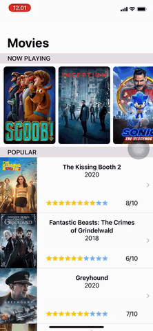
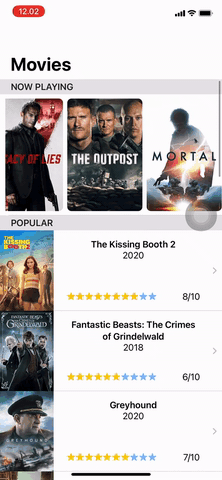

# Movie App using Declarative UI : SwiftUI/Jetpack Compose/Flutter
This is an app implemented using SwiftUI/Flutter/Jetpack Compose to display the now playing and popular movies using The Movie Database API. The purpose of the project is to explore the similarities and differences of the 3 Declarative UI frameworks: SwiftUI, jetpack Compose and Flutter. The 3 apps have been developed based on a Model-View-ViewModel (MVVM) design pattern.

## Declarative UI
Declarative programming which is in contrast to the widely used imperative programming is a programming paradigm where instead of coding the steps to create our user interface we define how the user interface should look like, leaving out details like the exact position and visual style of the elements and only describing what elements we need in our UI. It has been around since the 1990s, when we had Visual Basic and Delphi with visual form designers that let you lay out the user interface of your program in an intuitive way, what you see is what you get. Declarative UI increases the speed with which new technologies are developed, and allows for the seamless integration of the work of coders and designers. Declarative UI is a way of developing UIs by using declarative programming: a programming paradigm that expresses the logic of a computation without describing its control flow.

## Project context
During the summer of 2020 I had the opportunity to intern at Icehouse as a Frontend Software Engineer. During the 4 weeks that I spent there I was mentored by [Pierre Rafiq](https://www.linkedin.com/in/pierrerafiq/) and [Khairul Ushan](https://www.linkedin.com/in/khairil-ushan-80361254/) and was assigned a task to research software development practices that relate to the adoption of declarative UI programming in the context of mobile application development. This research spanned across native iOS (SwiftUI), Android technologies (Jetpack Compose), as well as Flutter (as a cross platform alternative). 

In order to carry out my research, I decided on developing an elementary mobile application with the help of [The Movie Database API](https://www.themoviedb.org). The purpose of the app was to display the currently “Popular” and “Now Playing” movies as a list, where the first cell of the list would contain a horizontal list containing the “Now Playing” movies and the cell thereafter would contain the currently “Popular” movies. Additionally, upon clicking on the movie, the user would be taken to another view displaying the movie’s details such as rating, plot summary, trailer links, etc. This mobile app allowed us to compare the basic differences between declarative programming and imperative programming. In addition to this, it also allowed me to get familiar with the nuances of the individual platforms. Moreover, to maintain consistency throughout the three platforms I decided on developing the app based on an MVVM design pattern. Such a design pattern allowed me to fully utilise the unique features that come with declarative programming inturn helping me fully understand its ability.

It must be noted that the pros and cons highlighted in this article are not universal to every programmer. This article solely highlights my experiences of working on these platforms as an intermediate level programmer.
## Swift UI
SwiftUI is Apple’s way of implementing a declarative UI. In Apple’s words SwiftUI is an innovative, exceptionally simple way to build user interfaces across all Apple platforms with the power of Swift. It was released during WWDC 2019. SwiftUI makes use of Views and modifiers to define the UI. In SwiftUI, Views are defined as structs and modifiers as protocol methods.  
  
  
## Jetpack Compose
Android Jetpack Compose is Google’s solution for implementing declarative UI. “Jetpack compose is a declarative UI toolkit built for Android, inspired by frameworks like React, Vue.js, and Flutter.” With compose, UI is defined as functions and the functions transform data into view hierarchies. A compose app is made up of composable functions - regular functions market with @composable, which can call other composable functions.

 
## Flutter
Flutter is an open-source UI software development kit created by Google. What separates it from Jetpack Compose and SwiftUI is its ability to do hybrid development for iOS and Android simultaneously. Flutter projects use the same Dart files which are transcribed into their iOS and Android counterparts when run, making it very useful for small teams and indie developers.

The Flutter UI itself is quite easy to follow, it uses an object oriented approach with all of its widgets being children of others. These widgets are fully customizable to suit the designer’s vision and its hot restart feature make it excellent for rapid prototyping designs. The convenience for cross platform development, easy to use UI, and quick compiles and updates make it an excellent choice for prototyping.
## Comparison between Swift/Jetpack/Flutter
|SwiftUI                      |Jetpack                      |Flutter                         |
|:----------------------------|:----------------------------|:-------------------------------|
| Released in 2019, lack of support for complex issues. Common errors documented on forums. | Released in 2019, lack of questions and posts on popular forums. | Released in 2018, it has plenty of common errors documented on forums. |
| SwiftUI documentation is fairly elaborate. | Jetpack documentation made by Google is not always clear and not user friendly. | Flutter documentation professionally made by the Google team. Clear presentation and partitions, easy to read. |
| SwiftUI introduction tutorial by Apple. | Lack of external libraries from the community and Google. | Plenty of useful libraries available from the community and official developers. |

